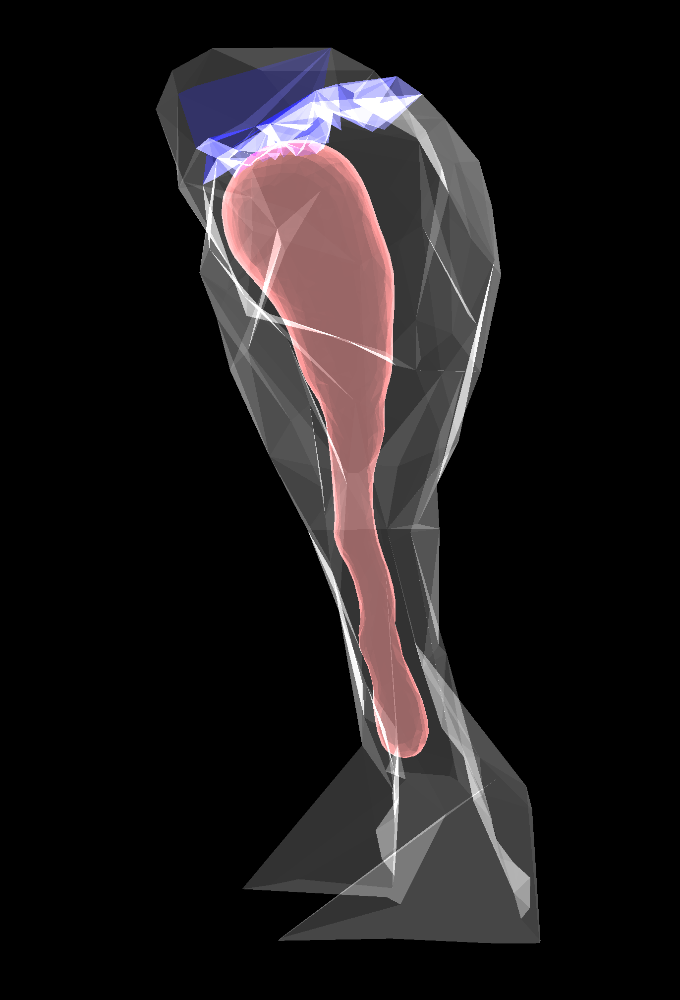

# Region of Interest (ROI) labeling for STEPS Tetmesh using Polyhedral surface boundaries

This module reads a list of surface boundary meshes, and a dictionary of ROI labeling signatures,
then create the ROIs according to the boundaries and labeling signatures.

## Prerequisite
* Python3.6 or above
* [STEPS](http://steps.sourceforge.net/)
* numpy
* trimesh
* Rtree

## Download and Installation
```
git clone https://github.com/CNS-OIST/STEPS_PolyhedronROI.git
cd STEPS_PolyhedronROI
python setup.py install
```

## Usage
in `Python` interface, import the module
```
import polyhedronROI
```

The first step is to create a spatial index of the mesh elements
```
spatial_index = polyhedronROI.gen_tet_spatial_index(TETMESH, IMPORT_SCALE)
```
* `TETMESH`: A steps.geom.Tetmesh object
* `IMPORT_SCALE`: The scale used when the mesh is imported to STEPS.

The tetrahedral ROIs can be defined and added to `TETMESH` using
```
polyhedronROI.add_tet_ROIs(TETMESH, IMPORT_SCALE, spatial_index, BOUNDARY_FILES, ROI_LABELS)
```

* `BOUNDARY_FILES`: A list of strings, each string stores the location of a boundary surface mesh file. for example
```
boundary_files = ["meshes/ER.stl", "meshes/PSD.stl"]
``` 
* `ROI_LABELS`: A `dict` of [`ROI_ID` : `ROI_SIGNATURES`] pairs.
    * `ROI_ID`: Name id of the ROI
    * `ROI_SIGNATURES`: A sign string consisting of only `+`, `-` and `*`. The length of the
    string should be the same as `len(BOUNDARY_FILES)`. For a boundary file `BOUNDARY_FILES[b]`,
    the signature `ROI_SIGNATURES[b]` should be
        * `+`: if the ROI elements are not inside the boundary mesh
        * `-`: if the ROI elements are inside the boundary mesh
        * `*`: if ROI elements have no particular spatial relationship with the boundary


## Example
An example is provided in [example/spine_rois.py](example/spine_rois.py).

This example imports a dendritic spine mesh reconstruction to STEPS,
and creates tetrahedral Regions of Interest (ROI)s using polyhedral surface boundaries.
The mesh with newly created ROIs is then exported to STEPS xml format,
and visualized using steps.visual module.

### Prerequisite for the example
* [STEPS](http://steps.sourceforge.net/)
* pyqtgraph
* PyOpenGL
* PyQt5

### Run the example
```
cd example
python spine_rois.py
```

